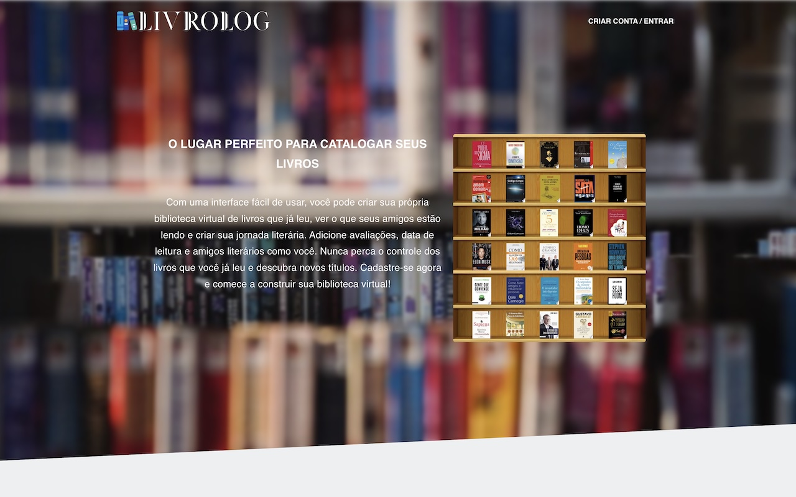

# LivroLog 📚

Personal library management system that allows users to organize their reading collection, follow other readers, and share book recommendations with Google Books API integration.

<p align="center">
<a href="https://www.buymeacoffee.com/arnonrdp" target="_blank"></a>
<a href="https://livrolog.com"></a>


<br />


</p>

- Add all the books you've read to your shelf
- Follow your friends, see what each person's shelf looks like and find out what they just finished reading
- Download an image of your shelf and use it as a background in your video calls



_Developed with ❤️ for book lovers_

## 🏗️ Architecture

```
LivroLog/
├── api/                # Laravel 12 Backend + MySQL + Redis
├── webapp/             # Vue.js 3 + Quasar Frontend
└── docker-compose.yml  # Services orchestration
```

## 🚀 Quick Start

```bash
git clone https://github.com/arnonrdp/LivroLog.git
cd LivroLog
cp .env.example .env
```

Then pick one of the two setups below.

<details>
<summary><b>🐳 With Docker</b> — MySQL, Redis, Mailpit and Reverb included</summary>

1. **Start services**

```bash
docker-compose up -d
```

2. **Setup backend**

```bash
docker exec livrolog-api composer install
docker exec livrolog-api php artisan key:generate
docker exec livrolog-api php artisan migrate
```

3. **Setup frontend**

```bash
docker exec livrolog-frontend yarn install
docker exec livrolog-frontend yarn dev
```

</details>

<details>
<summary><b>💻 Without Docker</b> — PHP, Composer, Yarn and a local SQLite file</summary>

Requires PHP 8.4+ (with `pdo_sqlite`), Composer, Node 24+ and Yarn. On macOS: `brew install php composer node yarn`.

1. **Point the API at SQLite**

```bash
cd api
cp .env.example .env
```

Edit `api/.env` — everything else works as shipped:

```ini
DB_CONNECTION=sqlite
DB_DATABASE=/absolute/path/to/LivroLog/api/database/database.sqlite
SESSION_DRIVER=file     # no Redis running locally
MAIL_MAILER=log         # no Mailpit; mail goes to storage/logs/laravel.log
```

2. **Setup backend**

```bash
composer install
php artisan key:generate
touch database/database.sqlite
php artisan migrate --seed          # seeds 10 users, admin@livrolog.com / admin123
```

3. **Run backend** (one terminal each)

```bash
php artisan serve --port=8000
php artisan queue:work               # Amazon enrichment jobs
php artisan reverb:start --port=8080 # optional, WebSocket notifications
```

4. **Run frontend**

```bash
cd ../webapp
cp .env.example .env
yarn install
yarn dev --port 8001
```

Google sign-in only works on origins registered in the Google Cloud client — use email/password locally.

</details>

## 📋 Services

- **Backend API**: http://localhost:8000 ([Documentation](http://localhost:8000/documentation))
- **Frontend**: http://localhost:8001
- **MySQL**: localhost:3306 _(Docker only — the local setup uses a SQLite file)_
- **Redis**: localhost:6379 _(Docker only — the local setup uses file/database drivers)_

## 📚 Documentation

- **[📁 Backend API Documentation](./api/README.md)** - Laravel backend, database, and API details
- **[🎨 Frontend Documentation](./webapp/README.md)** - Vue.js frontend and UI components

## 🏆 Tech Stack

**Backend**: Laravel 12, PHP 8.4, MySQL 8.0, Redis 7.0, Laravel Sanctum  
**Frontend**: Vue.js 3, Quasar Framework, TypeScript, Pinia  
**Infrastructure**: Docker, Docker Compose, Nginx

## 🤝 Contributing

1. Fork the project
2. Create feature branch (`git checkout -b feature/new-feature`)
3. Commit changes (`git commit -am 'Add new feature'`)
4. Push to branch (`git push origin feature/new-feature`)
5. Open Pull Request
